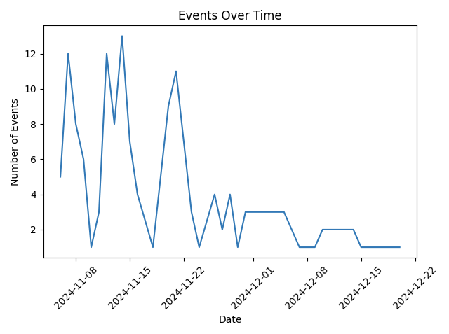
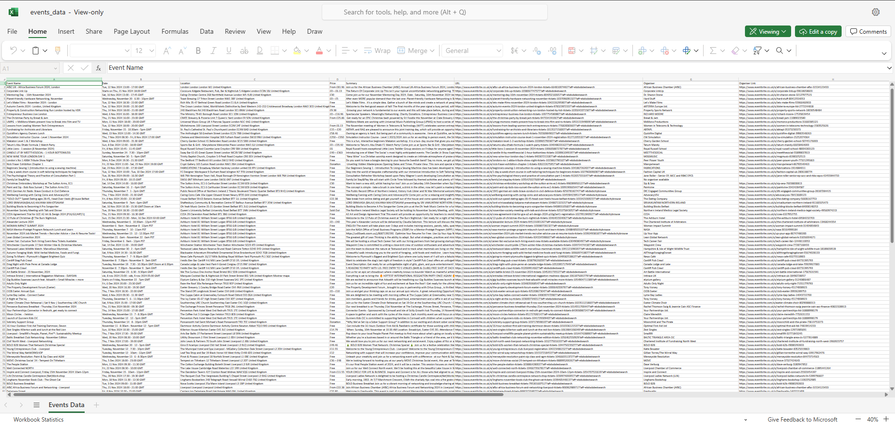

# Event-Hoarder | Event Scraper & Data Analyzer

## Contents
* [Main Blurb](#main-blurb)
* [Target Audience](#target-audience)
* [User Experience](#user-experience)
* [Design Choices](#design-choices)
* [Features](#features)
    * [Future Implementations](#future-implementations)
* [Images](#project-images)
* [Testing](#testing)
* [Languages](#languages-that-were-used-for-this-project)
    * [Other Libraries Used](#other-libraries-used)
* [Deployment](#deployment)
    * [Clone The Repository](#how-to-clone-this-repository)
    * [How To Create A Fork](#how-to-fork-this-repository)
* [Credits](#credits)
    * [Creator](#creator)
    * [Media](#media)

## Main Blurb
This project is led with the idea of collecting event data as you search, saved automatically to a wipeable database, to then perform various data manipulation tasks on this user-collected data, with no request restrictions either. The main data features are:

- **Sort Events**
  - Free events
  - Cheapest events
  - Most expensive events
  - Events happening soon
  - Closest distance events
- **Compare Events**
  - Average price of events
  - Median price of events
  - Event count per day
  - Event count per month
  - Event price distribution
  - Event dates over time

You may scrape for events by specific dates and top event categories, or just search for top events in your area.

Total time on this project - 

## Target Audience

My target audience would ideally be a wide range of age groups between 13 and 65. Events cater to a wide range of age groups and my application includes searching for almost anything, and also within any date optionally specified.

## User Experience

Event-Hoarder is designed to be user-friendly and efficient. Users can quickly search for events based on various criteria and have the data automatically saved for further analysis. The console-based interface ensures a straightforward experience, while the backend handles data storage and processing seamlessly.

## Design Choices

This is a console-based Python application that includes 24 modules and libraries. Event data is stored in a MongoDB and user-created CSV/Excel or data graph/visualizations are stored in Google Cloud Storage (GCS) with links being provided to access and download this content. Event data is stored indefinitely until wiped, although CSV/Excel or data graph/visualizations are deleted on program exit, so do view or save these before you close. I chose Eventbrite.co.uk to be selected to scrape from after trying out multiple other websites (Ticketmaster, TicketWeb, Universe) I found that Eventbrite was very relaxed on bots on their site and found it very interesting looking through their web code.
Graph visualizations are generated with the help from the matplotlib.pyplot library. I was attracted to this library as it offered easy customization of generated visualizations. BeautifulSoup was used as my scraper tool and I loved its easy to understand commands such as 'get_text()' or 'find()' & 'find_all()'. Geopy library has been very usefull for calculating distances between the user and events, it does this with the geodesic distance which is more accurate than the haversine formula for calculating distance between two points on the earths surface as it accounts for the earths ellipsoidal shape.

## Features

- **Event Sorting**: Easily find free, cheapest, most expensive, soonest, and closest events.
- **Event Comparison**: Analyze average and median prices, event counts by day or month, price distribution, and event dates over time.
- **Data Export**: Export data to CSV or Excel and generate visualizations to then view/download with a google cloud link.
- **Inbuilt Storage**: Store event data in MongoDB and visualizations in Google Cloud Storage.

### Future Implementations

- Add support for additional event websites.
- Implement a graphical user interface (GUI) for easier interaction.
- Enhance data analysis capabilities with more sophisticated algorithms.
- Include sorting/comapring by organizers
- Utilize the event tags more than counting most common, e.g filter/compare by tags

## Images

### Menu

### Quick Searching

### Events List

### More Events

### Top Category's Search

### Recent Searches

### Save Events or Perform Tasks

### Sort Events

### Compare Events

### View File Links

### Data Visualizations

### Excel Event Data Export

## Testing

Thorough manual testing was conducted to ensure the reliability and accuracy of the data scraping, storage, menu's and analysis processes.

## Languages that were used for this project

- **Python**: The main programming language used for developing the application.

### Other Libraries Used

- **MongoDB**: For storing event data.
- **Google Cloud Storage**: For saving user-created CSV/Excel files and visualizations.
- **matplotlib**: For generating visualizations.
- **BeautifulSoup**: For web scraping.
- **Geopy**: For distance between user and events calculations

## Deployment

### How I deployed my project

My project was deployed to heroku, being sure to include the correct dependencies such as having:

- **requirements.txt**
 - To declare all the programs libraries and modules
- **Procfile**
 - To specify how heroku should start the application
- **Config Vars**
 -  Where sensitive information critical for this project should be kept

After confirming these, I connected my GitHub to the Deploy section on the heroku dashboard and deployed the main branch of my projects repository.

### How to clone this repository

To clone this repository, use the following command:

git clone https://github.com/yourusername/Event-Hoarder.git

### How to fork this repository

To fork this repository, follow these steps:

Navigate to the repository on GitHub.

Click the "Fork" button at the top right of the page.

Select your GitHub account to fork the repository to.

## Credits

### Creator
This project was created by me, Max Wiseman

### Media
Any media used in this project is either created by the author or used under fair use for educational purposes.

### Acknowledgements
Thanks to the developers of the libraries and frameworks used in this project.

Special thanks to Eventbrite for allowing scraping.

### More words from developer

This project is a labor of love (1396 lines) and a testament to the power of data. I hope it brings value to users and inspires further exploration in the world of event data analysis.